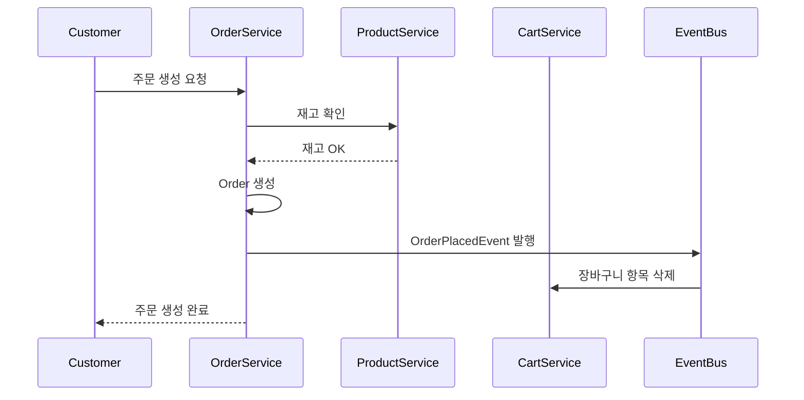

# Domain Event Flows

도메인 이벤트 기반 비동기 처리 플로우 문서

---

## 이벤트 아키텍처

### 이벤트 발행 메커니즘

```java
// 1. Aggregate에서 도메인 이벤트 생성
public class Order extends AggregateRoot {
    public void confirm() {
        this.status = OrderStatus.CONFIRMED;
        this.confirmedAt = LocalDateTime.now();

        // 도메인 이벤트 추가
        addDomainEvent(new OrderConfirmedEvent(this.getId(), this.customerId));
    }
}

// 2. Service에서 이벤트 발행
@Transactional
public void confirmOrder(Long orderId) {
    Order order = orderRepository.findById(orderId).orElseThrow();
    order.confirm();

    // 트랜잭션 커밋 전에 이벤트 발행
    eventPublisher.publishEvents(order);
}

// 3. Event Handler에서 처리
@Component
public class OrderEventHandler {
    @TransactionalEventListener(phase = TransactionPhase.AFTER_COMMIT)
    public void handleOrderConfirmed(OrderConfirmedEvent event) {
        // 재고 감소, 배송 시작, 알림 발송 등
    }
}
```

---

## 1. 주문 플로우

### 1.1 주문 생성 플로우



**이벤트 체인**

1. **OrderPlacedEvent** 발행
   ```java
   @Getter
   public class OrderPlacedEvent implements DomainEvent {
       private final Long orderId;
       private final Long customerId;
       private final BigDecimal totalAmount;
       private final List<Long> productIds;
       private final LocalDateTime occurredOn;
   }
   ```

2. **Event Handlers**
   ```java
   // CartEventHandler
   @TransactionalEventListener(phase = AFTER_COMMIT)
   public void handleOrderPlaced(OrderPlacedEvent event) {
       // 주문한 장바구니 항목 삭제
       cartService.removeOrderedItems(event.getCustomerId(), event.getProductIds());
   }

   // PaymentEventHandler
   @TransactionalEventListener(phase = AFTER_COMMIT)
   public void handleOrderPlaced(OrderPlacedEvent event) {
       // 결제 대기 알림
       notificationService.sendPaymentWaitingNotification(event.getCustomerId());
   }
   ```

### 1.2 결제 완료 플로우

```
[OrderPlacedEvent]
        ↓
[Customer가 결제]
        ↓
[PaymentProcessedEvent]
        ↓
    ┌───┴───┐
    ↓       ↓
[OrderConfirmedEvent]  [CustomerPointEarnedEvent]
    ↓
┌───┴───┬────────┬────────┐
↓       ↓        ↓        ↓
[ProductStockDecreased]  [ShippingStartedEvent]  [CustomerLevelUpdated]  [NotificationSent]
```

**1. PaymentProcessedEvent**
```java
@Getter
public class PaymentProcessedEvent implements DomainEvent {
    private final Long paymentId;
    private final Long orderId;
    private final Long customerId;
    private final BigDecimal amount;
    private final String paymentMethod;
    private final LocalDateTime occurredOn;
}
```

**2. 이벤트 핸들러**

```java
@Component
@RequiredArgsConstructor
public class PaymentEventHandler {

    private final OrderService orderService;
    private final CustomerService customerService;

    // 결제 완료 시 주문 확정
    @TransactionalEventListener(phase = AFTER_COMMIT)
    public void handlePaymentProcessed(PaymentProcessedEvent event) {
        // 주문 상태를 CONFIRMED로 변경
        orderService.confirmOrder(event.getOrderId());

        // 구매 금액 누적 및 포인트 적립
        customerService.updatePurchaseHistory(
            event.getCustomerId(),
            event.getAmount()
        );
    }
}

@Component
@RequiredArgsConstructor
public class OrderEventHandler {

    private final ProductService productService;
    private final ShippingService shippingService;
    private final NotificationService notificationService;

    // 주문 확정 시 재고 감소 및 배송 시작
    @TransactionalEventListener(phase = AFTER_COMMIT)
    public void handleOrderConfirmed(OrderConfirmedEvent event) {
        // 1. 상품 재고 감소
        event.getOrderItems().forEach(item -> {
            productService.decreaseStock(
                item.getProductId(),
                item.getQuantity()
            );
        });

        // 2. 배송 시작
        shippingService.startShipping(event.getOrderId());

        // 3. 주문 확정 알림
        notificationService.sendOrderConfirmationNotification(
            event.getCustomerId(),
            event.getOrderNumber()
        );
    }
}
```

### 1.3 주문 취소 플로우

```
[OrderCancelledEvent]
        ↓
┌───────┴──────┬──────────┬────────┐
↓              ↓          ↓        ↓
[PaymentRefunded]  [StockRestored]  [CouponRestored]  [PointRestored]
```

**OrderCancelledEvent**
```java
@Getter
public class OrderCancelledEvent implements DomainEvent {
    private final Long orderId;
    private final Long customerId;
    private final String cancellationReason;
    private final BigDecimal refundAmount;
    private final List<OrderItemDto> orderItems;
    private final Long couponId;
    private final Integer usedPoint;
    private final LocalDateTime occurredOn;
}
```

**이벤트 핸들러**

```java
@Component
@RequiredArgsConstructor
public class OrderCancellationHandler {

    private final PaymentService paymentService;
    private final ProductService productService;
    private final CouponService couponService;
    private final CustomerService customerService;

    @TransactionalEventListener(phase = AFTER_COMMIT)
    public void handleOrderCancelled(OrderCancelledEvent event) {
        // 1. 결제 환불 처리
        if (event.getRefundAmount().compareTo(BigDecimal.ZERO) > 0) {
            paymentService.processRefund(
                event.getOrderId(),
                event.getRefundAmount(),
                event.getCancellationReason()
            );
        }

        // 2. 재고 복구
        event.getOrderItems().forEach(item -> {
            productService.increaseStock(
                item.getProductId(),
                item.getQuantity()
            );
        });

        // 3. 쿠폰 복구
        if (event.getCouponId() != null) {
            couponService.restoreCoupon(
                event.getCustomerId(),
                event.getCouponId()
            );
        }

        // 4. 포인트 복구
        if (event.getUsedPoint() > 0) {
            customerService.restorePoints(
                event.getCustomerId(),
                event.getUsedPoint()
            );
        }
    }
}
```

---

## 2. 상품 도메인 이벤트

### 2.1 상품 재고 변경 플로우

**ProductStockChangedEvent**
```java
@Getter
public class ProductStockChangedEvent implements DomainEvent {
    private final Long productId;
    private final Integer previousStock;
    private final Integer currentStock;
    private final Integer changedAmount;
    private final String reason;
    private final LocalDateTime occurredOn;
}
```

**이벤트 핸들러**

```java
@Component
@RequiredArgsConstructor
public class ProductStockEventHandler {

    private final NotificationService notificationService;
    private final ProductRepository productRepository;

    @TransactionalEventListener(phase = AFTER_COMMIT)
    public void handleStockChanged(ProductStockChangedEvent event) {
        // 1. 재고 부족 알림 (재고 10개 이하)
        if (event.getCurrentStock() <= 10 && event.getCurrentStock() > 0) {
            notificationService.sendLowStockAlert(event.getProductId());
        }

        // 2. 품절 알림
        if (event.getCurrentStock() == 0) {
            notificationService.sendOutOfStockAlert(event.getProductId());

            // 찜한 사용자들에게 재입고 알림 신청 안내
            notificationService.sendRestockSubscriptionGuide(event.getProductId());
        }

        // 3. 재입고 알림 (품절 → 재입고)
        if (event.getPreviousStock() == 0 && event.getCurrentStock() > 0) {
            notificationService.sendRestockNotification(event.getProductId());
        }
    }
}
```

### 2.2 상품 가격 변경 플로우

**ProductPriceChangedEvent**
```java
@Getter
public class ProductPriceChangedEvent implements DomainEvent {
    private final Long productId;
    private final BigDecimal previousPrice;
    private final BigDecimal currentPrice;
    private final BigDecimal changeRate;
    private final LocalDateTime occurredOn;
}
```

**이벤트 핸들러**

```java
@Component
@RequiredArgsConstructor
public class ProductPriceEventHandler {

    private final NotificationService notificationService;

    @TransactionalEventListener(phase = AFTER_COMMIT)
    public void handlePriceChanged(ProductPriceChangedEvent event) {
        // 가격 인하 시 찜한 사용자들에게 알림
        if (event.getCurrentPrice().compareTo(event.getPreviousPrice()) < 0) {
            notificationService.sendPriceDropNotification(
                event.getProductId(),
                event.getChangeRate()
            );
        }
    }
}
```

---

## 3. 고객 도메인 이벤트

### 3.1 회원가입 플로우

**CustomerRegisteredEvent**
```java
@Getter
public class CustomerRegisteredEvent implements DomainEvent {
    private final Long customerId;
    private final String email;
    private final String name;
    private final LocalDateTime occurredOn;
}
```

**이벤트 핸들러**

```java
@Component
@RequiredArgsConstructor
public class CustomerRegistrationHandler {

    private final CouponService couponService;
    private final NotificationService notificationService;
    private final CartService cartService;

    @TransactionalEventListener(phase = AFTER_COMMIT)
    public void handleCustomerRegistered(CustomerRegisteredEvent event) {
        // 1. 웰컴 쿠폰 발급
        couponService.issueWelcomeCoupon(event.getCustomerId());

        // 2. 장바구니 생성
        cartService.createCart(event.getCustomerId());

        // 3. 환영 이메일 발송
        notificationService.sendWelcomeEmail(
            event.getCustomerId(),
            event.getEmail(),
            event.getName()
        );
    }
}
```

### 3.2 등급 업 플로우

**CustomerLevelUpEvent**
```java
@Getter
public class CustomerLevelUpEvent implements DomainEvent {
    private final Long customerId;
    private final CustomerLevel previousLevel;
    private final CustomerLevel currentLevel;
    private final Integer totalPurchaseAmount;
    private final LocalDateTime occurredOn;
}
```

**이벤트 핸들러**

```java
@Component
@RequiredArgsConstructor
public class CustomerLevelEventHandler {

    private final CouponService couponService;
    private final NotificationService notificationService;

    @TransactionalEventListener(phase = AFTER_COMMIT)
    public void handleLevelUp(CustomerLevelUpEvent event) {
        // 1. 등급 업 축하 쿠폰 발급
        couponService.issueLevelUpCoupon(
            event.getCustomerId(),
            event.getCurrentLevel()
        );

        // 2. 등급 업 축하 알림
        notificationService.sendLevelUpNotification(
            event.getCustomerId(),
            event.getCurrentLevel()
        );
    }
}
```

---

## 4. 리뷰 도메인 이벤트

### 4.1 리뷰 작성 플로우

**ReviewCreatedEvent**
```java
@Getter
public class ReviewCreatedEvent implements DomainEvent {
    private final Long reviewId;
    private final Long productId;
    private final Long customerId;
    private final Long orderId;
    private final Integer rating;
    private final LocalDateTime occurredOn;
}
```

**이벤트 핸들러**

```java
@Component
@RequiredArgsConstructor
public class ReviewEventHandler {

    private final ProductService productService;
    private final CustomerService customerService;

    @TransactionalEventListener(phase = AFTER_COMMIT)
    public void handleReviewCreated(ReviewCreatedEvent event) {
        // 1. 상품 평점 재계산
        productService.updateAverageRating(event.getProductId());

        // 2. 리뷰 작성 포인트 적립 (텍스트 리뷰: 100P, 포토 리뷰: 500P)
        customerService.earnReviewPoints(
            event.getCustomerId(),
            event.getReviewId()
        );
    }
}
```

---

## 5. 배송 도메인 이벤트

### 5.1 배송 시작 플로우

**ShippingStartedEvent**
```java
@Getter
public class ShippingStartedEvent implements DomainEvent {
    private final Long shippingId;
    private final Long orderId;
    private final String trackingNumber;
    private final String shippingCompany;
    private final LocalDateTime occurredOn;
}
```

**이벤트 핸들러**

```java
@Component
@RequiredArgsConstructor
public class ShippingEventHandler {

    private final OrderService orderService;
    private final NotificationService notificationService;

    @TransactionalEventListener(phase = AFTER_COMMIT)
    public void handleShippingStarted(ShippingStartedEvent event) {
        // 1. 주문 상태를 SHIPPED로 변경
        orderService.updateOrderStatus(event.getOrderId(), OrderStatus.SHIPPED);

        // 2. 배송 시작 알림
        notificationService.sendShippingStartNotification(
            event.getOrderId(),
            event.getTrackingNumber(),
            event.getShippingCompany()
        );
    }
}
```

### 5.2 배송 완료 플로우

**ShippingDeliveredEvent**
```java
@Getter
public class ShippingDeliveredEvent implements DomainEvent {
    private final Long shippingId;
    private final Long orderId;
    private final Long customerId;
    private final LocalDateTime occurredOn;
}
```

**이벤트 핸들러**

```java
@Component
@RequiredArgsConstructor
public class ShippingDeliveryHandler {

    private final OrderService orderService;
    private final NotificationService notificationService;

    @TransactionalEventListener(phase = AFTER_COMMIT)
    public void handleDelivered(ShippingDeliveredEvent event) {
        // 1. 주문 상태를 DELIVERED로 변경
        orderService.updateOrderStatus(event.getOrderId(), OrderStatus.DELIVERED);

        // 2. 배송 완료 알림
        notificationService.sendDeliveryCompleteNotification(
            event.getCustomerId(),
            event.getOrderId()
        );

        // 3. 리뷰 작성 요청 (3일 후 자동 발송 스케줄링)
        notificationService.scheduleReviewRequestNotification(
            event.getCustomerId(),
            event.getOrderId(),
            3 // 3일 후
        );
    }
}
```

---

## 6. 쿠폰 도메인 이벤트

### 6.1 쿠폰 발급 플로우

**CouponIssuedEvent**
```java
@Getter
public class CouponIssuedEvent implements DomainEvent {
    private final Long couponId;
    private final Long customerId;
    private final String couponName;
    private final BigDecimal discountAmount;
    private final LocalDateTime validUntil;
    private final LocalDateTime occurredOn;
}
```

**이벤트 핸들러**

```java
@Component
@RequiredArgsConstructor
public class CouponEventHandler {

    private final NotificationService notificationService;

    @TransactionalEventListener(phase = AFTER_COMMIT)
    public void handleCouponIssued(CouponIssuedEvent event) {
        // 쿠폰 발급 알림
        notificationService.sendCouponIssuedNotification(
            event.getCustomerId(),
            event.getCouponName(),
            event.getDiscountAmount(),
            event.getValidUntil()
        );
    }
}
```

---

## 7. 이벤트 처리 Best Practices

### 7.1 멱등성(Idempotency) 보장

```java
@Component
@RequiredArgsConstructor
public class IdempotentEventHandler {

    private final EventProcessingLogRepository logRepository;

    @TransactionalEventListener(phase = AFTER_COMMIT)
    public void handleOrderConfirmed(OrderConfirmedEvent event) {
        // 이벤트 ID 생성 (이벤트 타입 + 도메인 ID)
        String eventId = "OrderConfirmed-" + event.getOrderId();

        // 이미 처리된 이벤트인지 확인
        if (logRepository.existsByEventId(eventId)) {
            log.info("Event already processed: {}", eventId);
            return;
        }

        try {
            // 실제 비즈니스 로직 처리
            processOrderConfirmation(event);

            // 처리 완료 기록
            logRepository.save(new EventProcessingLog(
                eventId,
                event.getClass().getSimpleName(),
                "SUCCESS",
                LocalDateTime.now()
            ));
        } catch (Exception e) {
            // 에러 기록
            logRepository.save(new EventProcessingLog(
                eventId,
                event.getClass().getSimpleName(),
                "FAILED",
                LocalDateTime.now()
            ));
            throw e;
        }
    }
}
```

### 7.2 이벤트 재시도 전략

```java
@Component
public class RetryableEventHandler {

    @RetryableTopic(
        attempts = "3",
        backoff = @Backoff(delay = 1000, multiplier = 2)
    )
    @TransactionalEventListener(phase = AFTER_COMMIT)
    public void handlePaymentProcessed(PaymentProcessedEvent event) {
        // 외부 API 호출 등 실패 가능성이 있는 작업
        externalPaymentSystem.notifyPaymentSuccess(event);
    }

    @DltHandler
    public void handlePaymentProcessedDlt(PaymentProcessedEvent event) {
        // 모든 재시도 실패 시 DLQ(Dead Letter Queue)로 전송
        log.error("Failed to process payment event after all retries: {}", event);
        deadLetterQueue.send(event);
    }
}
```

### 7.3 이벤트 순서 보장

```java
@Component
public class SequentialEventHandler {

    @TransactionalEventListener(phase = AFTER_COMMIT)
    @Order(1)
    public void handleOrderConfirmedFirst(OrderConfirmedEvent event) {
        // 첫 번째로 실행
        productService.decreaseStock(event);
    }

    @TransactionalEventListener(phase = AFTER_COMMIT)
    @Order(2)
    public void handleOrderConfirmedSecond(OrderConfirmedEvent event) {
        // 두 번째로 실행
        shippingService.startShipping(event);
    }
}
```

---

## 8. 이벤트 모니터링

### 8.1 이벤트 통계

```sql
CREATE TABLE event_processing_stats (
    event_type VARCHAR(100) PRIMARY KEY,
    total_processed BIGINT NOT NULL DEFAULT 0,
    total_failed BIGINT NOT NULL DEFAULT 0,
    avg_processing_time_ms BIGINT NOT NULL DEFAULT 0,
    last_processed_at TIMESTAMP,
    created_at TIMESTAMP NOT NULL DEFAULT CURRENT_TIMESTAMP,
    updated_at TIMESTAMP NOT NULL DEFAULT CURRENT_TIMESTAMP ON UPDATE CURRENT_TIMESTAMP
);
```

### 8.2 이벤트 로깅

```java
@Aspect
@Component
@Slf4j
public class EventLoggingAspect {

    @Around("@annotation(org.springframework.transaction.event.TransactionalEventListener)")
    public Object logEventProcessing(ProceedingJoinPoint joinPoint) throws Throwable {
        String eventType = joinPoint.getArgs()[0].getClass().getSimpleName();
        long startTime = System.currentTimeMillis();

        try {
            Object result = joinPoint.proceed();
            long processingTime = System.currentTimeMillis() - startTime;

            log.info("Event processed successfully: {} in {}ms", eventType, processingTime);
            return result;
        } catch (Exception e) {
            log.error("Event processing failed: {}", eventType, e);
            throw e;
        }
    }
}
```

이상으로 도메인 이벤트 플로우 문서가 완성되었습니다!
